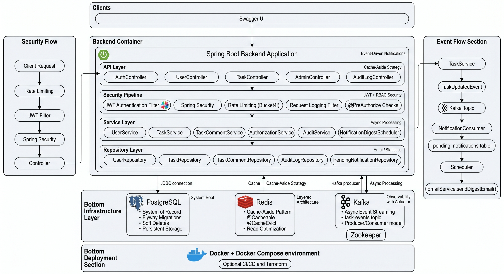

<p align="center">
  <h1 align="center">Task Management System</h1>
  <p align="center">Production-style Spring Boot backend for secure task management, auditing, caching, notifications, and deployment.</p>
</p>

<p align="center">
  
  
  
  
  
</p>

<br />

<p align="center">
  <b>THIS PROJECT IS BUILT FOR BACKEND ENGINEERING PRACTICE AND PORTFOLIO DEMOS. CONFIGURE REAL SECRETS SAFELY BEFORE PRODUCTION USE.</b>
</p>

<br />

## 📖 Contents

- [Overview](#overview)
- [Motivation](#motivation)
- [Features](#features)
- [Technologies](#technologies)
- [Working](#working)
- [Architecture](#architecture)
- [Getting Started](#getting-started)
- [Customization](#customization)
- [Usage](#usage)
  - [Authentication](#authentication)
  - [Tasks](#tasks)
  - [Admin](#admin)
- [Deployment](#deployment)
- [CI/CD](#cicd)
- [Contribute](#contribute)
- [License](#license)

## 🔍 Overview <a id="overview" />

Task Management System is an enterprise-style backend API built with Spring Boot. It goes beyond basic CRUD by adding production-minded features such as JWT authentication, role-based access control, Redis caching, audit logging, soft delete and restore, Kafka-based asynchronous notifications, rate limiting, Swagger documentation, Docker, and GitHub Actions CI/CD.

The project is designed to demonstrate how a real backend system is structured across controller, service, repository, security, configuration, infrastructure, and deployment layers.

## 💡 Motivation <a id="motivation" />

Most beginner backend projects stop at simple CRUD APIs. This project is built to show stronger backend engineering skills:

- secure APIs with JWT and RBAC
- clean service-layer authorization
- scalable caching with Redis
- event-driven architecture with Kafka
- persistent audit trails
- Dockerized local infrastructure
- CI/CD automation with GitHub Actions

The goal is to make the project interview-demo ready and close to how real systems are designed.

## ✨ Features <a id="features" />

This system includes production-style backend features such as:

- **JWT Authentication**: Login returns a signed token used to access protected APIs.

- **Role-Based Access Control**: `USER` can manage own tasks, while `ADMIN` can manage all users and tasks.

- **Task Management**: Create, update, search, assign, restore, and delete tasks with pagination support.

- **Task Status Workflow**: Dedicated status update API with transition validation.

- **Soft Delete**: Tasks are marked as deleted instead of being physically removed, with admin restore/hard-delete flows.

- **Audit Logging**: Important business actions are persisted for accountability and history.

- **Redis Caching**: Frequently accessed user and task APIs use cache-aside caching with eviction.

- **Rate Limiting**: Bucket4j-based per-IP rate limiting protects APIs from abuse.

- **Kafka Notifications**: Task events are published asynchronously and consumed into pending notifications.

- **Email Digest Scheduler**: Pending notifications can be grouped and sent as digest emails.

- **Swagger Documentation**: OpenAPI documentation includes API tags, JWT authorization, summaries, and DTO examples.

- **Docker Ready**: PostgreSQL, Redis, Kafka, Zookeeper, and the app are orchestrated through Docker Compose.

- **CI/CD Ready**: GitHub Actions builds, tests, creates Docker images, and supports EC2 deployment.

## ⚡️ Technologies <a id="technologies" />

- **Java 25**
- **Spring Boot 4**
- **Spring Web**
- **Spring Security**
- **Spring Data JPA**
- **PostgreSQL**
- **Flyway**
- **Redis**
- **Apache Kafka**
- **Zookeeper**
- **Bucket4j**
- **JWT**
- **Spring Mail**
- **Springdoc OpenAPI / Swagger**
- **Docker**
- **GitHub Actions**
- **AWS EC2**

## ❓ Working <a id="working" />

Here's a simple view of how the main request and event flow works in the system.

```text
Client
  ↓
Auth API
  ↓
JWT Token
  ↓
Protected APIs
  ↓
Service Layer Authorization
  ↓
PostgreSQL
```

For task events and notifications:

```text
Task Created / Updated / Commented
  ↓
Task Service
  ↓
Kafka Producer
  ↓
task-events Topic
  ↓
Notification Consumer
  ↓
pending_notifications Table
  ↓
Digest Scheduler
  ↓
Email Service
```

Redis is used with the cache-aside pattern:

```text
Request
  ↓
Check Redis Cache
  ↓
Cache Hit → Return Response
  ↓
Cache Miss → Query PostgreSQL
  ↓
Store DTO in Redis
  ↓
Return Response
```

## 🏭 Architecture <a id="architecture" />

The project follows a layered monolithic architecture with event-driven components for asynchronous workflows.



**Why layered architecture?**

It keeps responsibilities clear. Controllers handle HTTP, services handle business rules, repositories handle persistence, and security/configuration stays isolated.

**Why event driven?**

Task updates should not be tightly coupled to email sending. Kafka allows the system to publish that something happened and let notification processing happen asynchronously.

**Why Redis?**

Redis reduces repeated database reads for frequently accessed data such as users and filtered task lists.

**Why Docker Compose?**

The project depends on multiple infrastructure services. Docker Compose gives a repeatable local environment for development, testing, and demos.

## 🍕 Getting Started <a id="getting-started" />

Here we will set up the project locally.

**Tools**

- [Java 25](https://adoptium.net/)
- [Maven](https://maven.apache.org/)
- [Docker](https://docs.docker.com/get-docker/)
- [Docker Compose](https://docs.docker.com/compose/)
- [Postman](https://www.postman.com/) or any API client
- Git

**Steps**

1. Clone the repository.

```bash
$ git clone https://github.com/shivam-wayal/task-management-system.git
$ cd task-management-system
```

2. Create a local `.env` file.

```bash
$ cp .env.example .env
```

If `.env.example` does not exist yet, create `.env` manually:

```env
DB_NAME=taskdb
DB_USERNAME=postgres
DB_PASSWORD=postgres
JWT_SECRET=change-this-to-a-long-random-secret
SPRING_PROFILES_ACTIVE=docker
```

3. Start the full Docker environment.

```bash
$ docker compose up --build
```

4. Open Swagger UI.

```text
http://localhost:8080/swagger-ui/index.html
```

5. Check health endpoint.

```bash
$ curl http://localhost:8080/actuator/health
```

## 🛠 Customization <a id="customization" />

The project supports multiple Spring profiles:

- **dev**: Local development profile.
- **docker**: Docker Compose profile.
- **prod**: Production-style environment-variable based profile.

Common configuration values:

- `DB_URL`
- `DB_USERNAME`
- `DB_PASSWORD`
- `REDIS_HOST`
- `KAFKA_BOOTSTRAP_SERVERS`
- `JWT_SECRET`
- `MAIL_USERNAME`
- `MAIL_PASSWORD`
- `NOTIFICATION_DIGEST_RATE`

Never commit real secrets to the repository. Use `.env`, GitHub Actions secrets, or a cloud secret manager.

## 📚 Usage <a id="usage" />

### 🔐 Authentication <a id="authentication" />

Login with username and password:

```bash
$ curl -X POST http://localhost:8080/api/auth/login \
  -H "Content-Type: application/json" \
  -d '{
    "name": "admin",
    "password": "password"
  }'
```

Use the returned token:

```bash
$ export TOKEN=value-of-jwt-token
```

Call a protected route:

```bash
$ curl http://localhost:8080/api/users/me \
  -H "Authorization: Bearer $TOKEN"
```

### ✅ Tasks <a id="tasks" />

Create a task for a user:

```bash
$ curl -X POST http://localhost:8080/api/users/1/tasks \
  -H "Authorization: Bearer $TOKEN" \
  -H "Content-Type: application/json" \
  -d '{
    "title": "Implement deployment pipeline",
    "description": "Build CI/CD with GitHub Actions",
    "status": "TODO"
  }'
```

Update task status:

```bash
$ curl -X PATCH http://localhost:8080/api/tasks/1/status \
  -H "Authorization: Bearer $TOKEN" \
  -H "Content-Type: application/json" \
  -d '{
    "status": "IN_PROGRESS"
  }'
```

Search tasks:

```bash
$ curl "http://localhost:8080/api/tasks/search?status=TODO&page=0&size=10" \
  -H "Authorization: Bearer $TOKEN"
```

Add a comment:

```bash
$ curl -X POST http://localhost:8080/api/tasks/1/comments \
  -H "Authorization: Bearer $TOKEN" \
  -H "Content-Type: application/json" \
  -d '{
    "message": "Deployment workflow added."
  }'
```

### 🛡 Admin <a id="admin" />

Get deleted tasks:

```bash
$ curl http://localhost:8080/api/admin/tasks/deleted \
  -H "Authorization: Bearer $TOKEN"
```

Hard delete a task:

```bash
$ curl -X DELETE http://localhost:8080/api/admin/tasks/1/hard-delete \
  -H "Authorization: Bearer $TOKEN"
```

Get audit logs:

```bash
$ curl "http://localhost:8080/api/audit-logs?action=CREATE_TASK" \
  -H "Authorization: Bearer $TOKEN"
```

## 🚀 Deployment <a id="deployment" />

The project can be deployed to AWS EC2 using Docker.

_Important: AWS resources may create real cost._

**Tools**

- AWS EC2 instance
- Ubuntu server
- Docker
- Docker Compose
- GitHub Actions

**Steps**

1. Launch an EC2 instance.

- AMI: Ubuntu 24.04 LTS
- Instance type: `t3.medium` or higher
- Open ports: `22`, `80`, `443`, and optionally `8080` for testing

2. SSH into the server.

```bash
$ ssh -i task-management-key.pem ubuntu@YOUR_EC2_PUBLIC_IP
```

3. Install Docker.

```bash
$ sudo apt update
$ sudo apt install -y ca-certificates curl gnupg
$ sudo install -m 0755 -d /etc/apt/keyrings
$ curl -fsSL https://download.docker.com/linux/ubuntu/gpg | sudo tee /etc/apt/keyrings/docker.asc > /dev/null
$ sudo chmod a+r /etc/apt/keyrings/docker.asc
$ echo "deb [arch=$(dpkg --print-architecture) signed-by=/etc/apt/keyrings/docker.asc] https://download.docker.com/linux/ubuntu $(. /etc/os-release && echo ${UBUNTU_CODENAME:-$VERSION_CODENAME}) stable" | sudo tee /etc/apt/sources.list.d/docker.list > /dev/null
$ sudo apt update
$ sudo apt install -y docker-ce docker-ce-cli containerd.io docker-buildx-plugin docker-compose-plugin
$ sudo usermod -aG docker ubuntu
```

4. Clone the repository and create `.env`.

```bash
$ git clone https://github.com/shivam-wayal/task-management-system.git
$ cd task-management-system
$ nano .env
```

5. Start the project.

```bash
$ docker compose up --build -d
```

6. Verify deployment.

```bash
$ docker compose ps
$ docker compose logs -f app
$ curl http://localhost:8080/actuator/health
```

Open:

```text
http://YOUR_EC2_PUBLIC_IP:8080/swagger-ui/index.html
```

## 🔁 CI/CD <a id="cicd" />

GitHub Actions workflow is available at:

```text
.github/workflows/ci-cd.yml
```

On pull request to `main`, the workflow:

- builds the project
- runs tests
- builds the Docker image

On push to `main`, the workflow:

- builds the project
- runs tests
- builds the Docker image
- pushes the image to GitHub Container Registry
- deploys if deployment is enabled

**Required GitHub Secrets**

- `DEPLOY_HOST`
- `DEPLOY_USER`
- `DEPLOY_SSH_KEY`
- `DB_URL`
- `DB_USERNAME`
- `DB_PASSWORD`
- `REDIS_HOST`
- `KAFKA_BOOTSTRAP_SERVERS`
- `JWT_SECRET`
- `MAIL_USERNAME`
- `MAIL_PASSWORD`

**Required GitHub Variable**

- `DEPLOY_ENABLED=true`

## 👏 Contribute <a id="contribute" />

Contributions are welcome. Before submitting a pull request, open an issue to discuss the change and make sure the project still passes:

```bash
$ ./mvnw clean test
```

Please keep code clean, tested, and consistent with the existing layered architecture.

## 📄 License <a id="license" />

This project is licensed under the MIT License. Add a `LICENSE` file before publishing the repository publicly.
